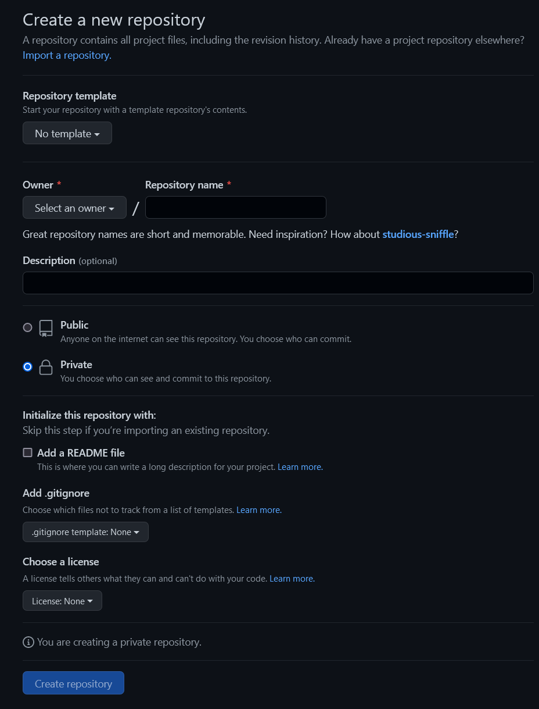

<!-- # Git-GitHub-GitHubClassroom -->
# Introduction: Git and GitHub
- Git is a free and open source distributed version control system.
- Git is used to tracking changes in the source code and enabling multiple developers to work together.
- GitHub is an online software development platform. It's used for storing, tracking, and collaborating on software projects.
 
## 1. Installing Git
First, we need to install Git: the version control software.
- Git:
  Install [git](https://git-scm.com/downloads)

## 2. Configuring Git Accountf
Open a terminal on your Windows or Mac and then write the following commands:


## 3. Initialize a Local Repository
1. First, let's start by creating a folder for our project. For this you can use the GUI of Windows or Mac, use a terminal or your preferred IDE.
2. Next, cd into your project folder: 
```shell
cd project_name
```
3. Finally, we need to initialize the repository using the following command:

```shell
git init
```


## 4. Staging & Tracking Files

### 4.1. Adding files to the staging area
4.1.1. Create a file named _index.html_ containing a simple _\<h1> tag_
4.1.2. Git does not know about the file _index.html_. We can check the tracked files using the following command:

```shell
git status
```
4.1.3. The git status command allows you to know the status of the project: If it is initiated, modified, staged


4.1.4. For Git to recognize this file, we need to add it to the staging area and create a commit. <br>
There are multiple ways to add files to the staging area. <br>
- Add a single file
```shell
   git add filename
```
- Add multiple files
```shell
   git add filename1 filename2
```
- Add multiple files and folders at once. Make sure to add a space between the add and the dot.
```shell
   git add .
```


4.1.5. To remove a file from the staging area, we need to use the following command:
```shell
    git rm --cached filename
```

### 4.2. Commits
A commit allows us to create a snapshot of the project state at that point of time. To create a commit, we use the following command with _-m_ stands for message and we list the message associated with this commit. 

```shell
   git commit -m 'your message'
```
The message should be short and accurately describes the changes made. A clear message would allow us to identify a specific commit and eventually roll back to that state if needed.


To list all commits in The Local Repository
```shell
   git log
```
To list only latest 3 commits
```shell
   git log -p -2
```
To go back to a specific commi
```shell
   git checkout commitID
```
## 5. Remote
First, we need to create an account GitHub.
- GitHub:
  [gitHub](https://github.com)

### 5.1. Create a Repository

### 5.2. Add a new remote to a local repository
```shell
   git remote add origin https://github.com/user/repo.git
```
### 5.3. Push to a remote repository: The git push command is used to upload local repository content to a remote repository
For the first push, we need to use this commend: 
```shell
   git push --set-upstream origin master
```
- --set-upstream: The git set-upstream allows you to set the default remote branch for your current local branch
- origin master: The default branch
### 5.4. Pull to a local repository: The git pull command si used to fetch and download content from a remote repository and immediately update the local repository to match that content
```shell
   git pull
```
### 5.5 Copy an existing remote repository onto your local machine
```shell
git clone URL_OF_REPO
```

## 6. Branches
The branch is the copy of the main(or master) at branching instant. After branching, the branch and the master don't see each other. 
You can create as many branches as you want.


### 6.1 Add a new Branch
```shell
git branch branch_name
```
### 6.2 Switch to another branch
```shell
git checkout branch_name
```
### 6.3 Create and checkout to the branch at the same time
```shell
git checkout -b branch-name
```
### 6.4 Merge a branch to the current branch
```shell
git merge branch_name
```
### 6.5 List of branch
```shell
git branch
```
### 6.6 Rename Branch
```shell
git branch -m <oldname> <newname>
```
### 6.7 Delete Branch
```shell
git branch -d branch-name
```
